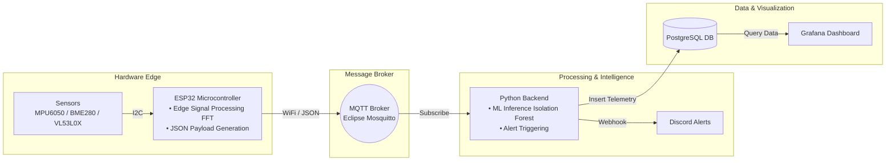
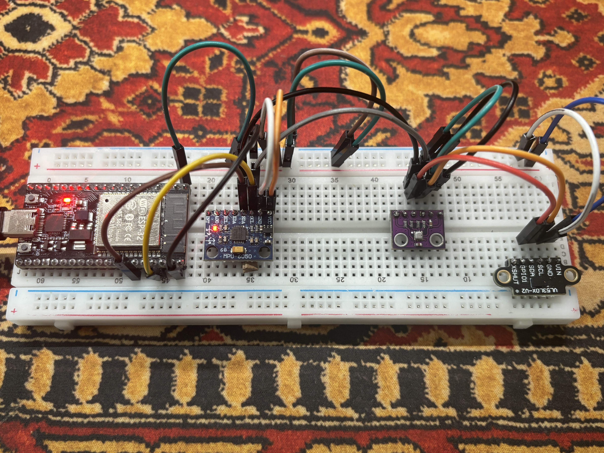
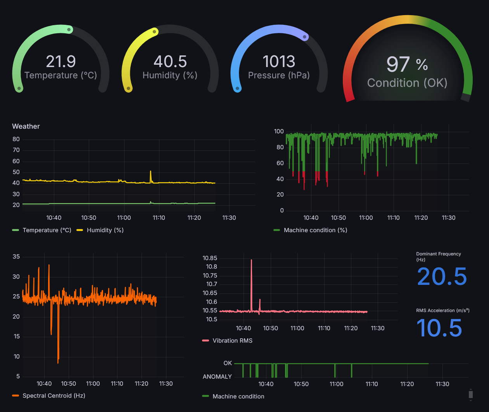

<div align="center">

# 🏭 Predictive Maintenance & Condition Monitoring System

  <p align="center">
    An end-to-end IoT platform for real-time industrial equipment monitoring, featuring edge DSP processing, machine learning anomaly detection, and automated alerting.
  </p>


</div>

---

## 📌 Overview

This project is a comprehensive **Condition Monitoring System** designed for industrial machinery. It processes high-frequency vibration data using Fast Fourier Transform (FFT) directly on the **ESP32 microcontroller (Edge Computing)**, sends telemetry over **MQTT**, predicts anomalies using an **Isolation Forest** model, stores time-series data in **PostgreSQL**, and visualizes metrics live on a **Grafana** dashboard.

### Key Features
* ⚡ **Edge Computing (DSP/FFT):** Calculates vibration features (RMS, Peak-to-Peak, Crest Factor, Skewness, Kurtosis, Dominant Frequency, Spectral Centroid) directly on the microcontroller.
* 🤖 **Machine Learning Anomaly Detection:** Python backend uses an Isolation Forest model & StandardScaler to evaluate machine health scores in real time.
* 📊 **Interactive Visualizations:** Fully provisioned Grafana dashboards showing environmental and vibration metrics.
* 🚨 **Automated Alerting:** Integration with Discord Webhooks for persistent anomaly notifications.
* 🔒 **Secure Design:** Clean separation of credentials using environment variables (`.env`) and local header inclusions (`secrets.h`).

---

## 🏗 System Architecture

---

## 🛠 Hardware Setup

The physical edge architecture features an ESP32 microcontroller acting as a real-time data acquisition and DSP unit, interacting with precision sensors via a shared I2C bus.

### Component Overview

| Component | Model | Function & Target Metrics | Interface |
| :--- | :--- | :--- | :--- |
| **Microcontroller** | ESP32-WROOM-32 | Edge DSP processing (FFT), Wi-Fi & MQTT transmission | Dual-Core 240MHz |
| **Vibration & Motion** | MPU6050 | 3-Axis Acceleration for time/frequency domain feature extraction | I2C (`0x68`) |
| **Environment** | BME280 | Ambient Temperature, Relative Humidity & Barometric Pressure | I2C (`0x76`) |
| **Distance & Position** | VL53L0X | Time-of-Flight (ToF) laser ranging for proximity/displacement | I2C (`0x29`) |

### Wiring & Power
* **Communication Bus:** Standard I2C (`SDA` -> GPIO 21, `SCL` -> GPIO 22) with shared pull-up resistors.
* **Power Supply:** Regulated 3.3V / 5V DC power rail with decoupled ground loops to ensure low-noise analog measurements.

<p align="center">
  
</p>

---

## 🚀 Getting Started

### Prerequisites
* **Hardware:** ESP32, MPU6050 (Accelerometer/Gyro), BME280 (Temp/Hum/Press), VL53L0X (Distance).
* **Software:** Docker & Docker Compose, Python 3.10+, PlatformIO or Arduino IDE.

### Installation & Setup

1. **Clone the Repository:**
```bash
   git clone https://github.com/ignaczy/iot-predictive-maintenance.git
   cd iot-predictive-maintenance
```

2. **Configure Environment Variables:**
```bash
   * **Backend:** Copy `.env.example` to `.env` and fill in your details:
     cp .env.example .env
```
   * **Microcontroller:** Create `src/secrets.h` with your Wi-Fi & MQTT credentials:
```c
     #ifndef SECRETS_H
     #define SECRETS_H
     #define WIFI_SSID "Your_WiFi_SSID"
     #define WIFI_PASSWORD "Your_WiFi_Password"
     #define MQTT_SERVER "Your_MQTT_Broker_IP"
     #define MQTT_PORT 1883
     #endif
```

3. **Run Infrastructure via Docker:**
```bash
   Launch PostgreSQL, Mosquitto MQTT, and Grafana with pre-configured provisioning:
   docker-compose up -d
```

4. **Run Python Backend:**
```bash
   pip install -r requirements.txt
   python python_backend/main.py
```

5. **Flash the ESP32:**
   Open the project in **PlatformIO** and upload the firmware to your ESP32 board.


---

## 📊 Dashboard Preview

> *Access Grafana at `http://localhost:3000` (Default credentials: `admin` / `admin`).*

  <p align="center">
   
  </p>

---

## 📄 License

Distributed under the **MIT License**. See `LICENSE` for more information.

---

## 👥 Author
* Ignacy Glura
* GitHub: [@ignaczy](https://github.com/ignaczy)